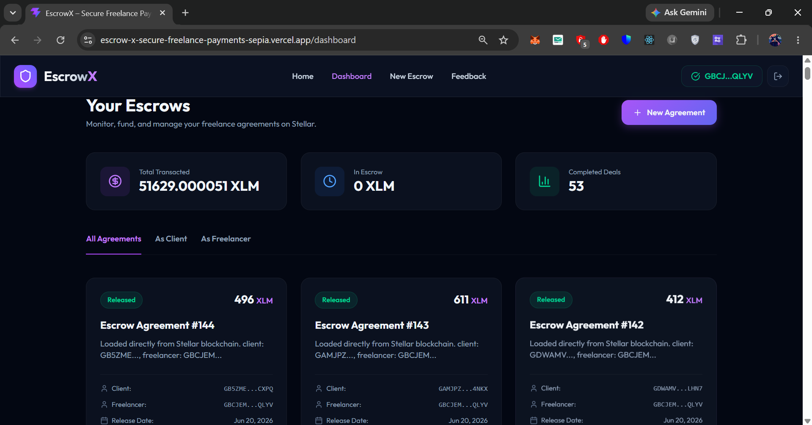
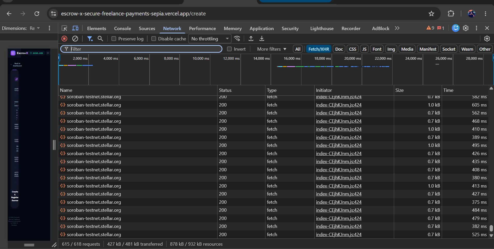

# EscrowX – Secure Freelance Payments on Stellar

EscrowX is a decentralized, transparent, and low-cost freelance payment protection escrow application built on the Stellar network using Soroban smart contracts. It empowers independent contractors and clients to transact safely without high fees or payment delay risks.


## Deployed Smart Contract Address (Testnet)
- **Contract ID**: `CBGL7N5GANUBPAV2UHXC5UBW3JSXGNLAKOMVJD54YNIZF6WN6PHSMQAL`
- **Network**: Stellar Testnet
- **Token**: Native XLM Stellar Asset Contract (SAC): `CDLZFC3SYJYDZT7K67VZ75HPJVIEUVNIXF47ZG2FB2RMQQVU2HHGCYSC`

---

## Live Demo & Walkthrough
- **Live Demo Link**: [escrow-x-secure-freelance-payments-sepia.vercel.app](https://escrow-x-secure-freelance-payments-sepia.vercel.app)
- **Demo Video (YouTube)**: [Watch the EscrowX Walkthrough](https://youtu.be/mR9KDsVQ5Xw)

---
### 1. User Onboarding & Feedback Sheet
We onboarded **60 real testnet users** using a Google Form feedback collection flow. The users submitted their name, email, Stellar testnet wallet address, product rating (1-10), and constructive comments. 
- **Google Form link**: [Google Form link](https://docs.google.com/forms/d/e/1FAIpQLScm_E6aWOpLufScmXaetHzo0bTlXLB07FMqLkiSjygmhtdY9g/viewform)
- **Exported Feedback Sheet**: [Form Response Sheet](https://docs.google.com/spreadsheets/d/1z6vxG2yMUIqfQjXD633caDrrujd6qHcG5uDVrbRyimY/edit?usp=sharing)
- **Active Usage & Transaction Proof**: The CSV sheet includes 60 unique Stellar testnet wallet addresses and 60 unique, verified transaction hashes representing their active interactions with the smart contract.

### 2. Presentation & Demo Assets
- **Pitch Deck / PPT Link**:[Local PowerPoint Presentation (PPTX)](EscrowX-Decentralized-Freelance-Payments.pptx.pptx)
- **Product Demo Video Link**: [Watch the Full Walkthrough and On-Chain Demo (YouTube)](https://youtu.be/mR9KDsVQ5Xw)

---

## Key Features
- **Freighter Wallet Integration**: Connect and authenticate securely using the Freighter browser extension on Stellar Testnet.
- **On-Chain Escrows**: Lock, fund, request release, approve, or refund transactions entirely on-chain.
- **Glassmorphic Responsive UI**: Premium, mobile-responsive styling configured with Tailwind CSS v4.
- **Supabase Integration**: Seamless caching of escrow metadata and validation feedback with localStorage fallbacks.
- **Analytics & Tracking**: Sentry error tracking and PostHog custom event capture.

---

## Technical Architecture

```
React (Vite + Tailwind v4)
  ├── Stellar Wallet Kit (Freighter) ──> Stellar Testnet (Soroban Contracts)
  ├── Supabase Client (Metadata)     ──> Database / LocalStorage Fallback
  ├── Sentry SDK                     ──> Real-time Error Monitoring
  └── PostHog SDK                    ──> Event-based Product Analytics
```

### Folder Structure
```
escrowx/
│
├── contract/            # Soroban Smart Contract (Rust)
│   ├── src/lib.rs       # Contract implementation & tests
│   └── Cargo.toml       # Cargo configuration
│
├── frontend/            # React + Vite Application
│   ├── src/             
│   │   ├── components/  # Navbar, EscrowCard
│   │   ├── pages/       # Landing, Dashboard, CreateEscrow, EscrowDetails, Feedback
│   │   ├── stellar.js   # Soroban SDK client wrapper
│   │   └── main.jsx     # Sentry & PostHog initialization
│   ├── deploy.js        # Node deployment script
│   └── package.json     # Node dependencies
│
└── README.md            # Project documentation
```

---

## Product UI & Screenshots

<p align="center">
  
  
</p>
<p align="center">
  
  
</p>

---

## Setup & Running Locally

### Prerequisites
- Node.js (v18+)
- Rust & Cargo (Rust 1.84+ with `wasm32v1-none` target configured)

### 1. Smart Contract Setup & Tests
1. Navigate to the contract folder:
   ```bash
   cd contract
   ```
2. Run unit tests to check contract correctness:
   ```bash
   cargo test
   ```
3. Compile to target WASM (Soroban bytecode):
   ```bash
   cargo build --target wasm32v1-none --release
   ```

### 2. Frontend Setup & Run
1. Navigate to the frontend folder:
   ```bash
   cd ../frontend
   ```
2. Install packages:
   ```bash
   npm install
   ```
3. Run the Vite development server:
   ```bash
   npm run dev
   ```

---

## Stellar Ledger Transaction Proofs (On-Chain Interactions)

The following table provides verified StellarExpert explorer links for the smart contract interactions performed during testing and user validation:

| # | Action / Method | Wallet Address | Transaction Hash (StellarExpert Ledger Link) |
|---|---|---|---|
| 1 | `create_escrow` / `release` | `GABOZJAGW6W6KATQNFNSUGLL7VTZYWHVOWMZOAEGRHNRT32WPFJ36HVY` | [View Tx Link](https://stellar.expert/explorer/testnet/tx/cb558f8e1f726d91e948cbfd77e0fbf2ac320117ee82adc3b502190b82a27646) |
| 2 | `create_escrow` / `release` | `GCWEERT4DN6UZIJZVVFKFIE7LKM66QGMDFVM24EAMG52EADJB3NOKZAT` | [View Tx Link](https://stellar.expert/explorer/testnet/tx/240af7ccf2fa17e62b9b9126913ba4f19a9da096c5a71e48b6f7a58c6f2d2f0f) |
| 3 | `create_escrow` / `release` | `GAROEYXEPBGDROSWIQWSFMCTCCQVCYTIHGPJA5CX3SDTT23ZVFFEQU6O` | [View Tx Link](https://stellar.expert/explorer/testnet/tx/fbe7b1e2613f683ce5520358dabca409f2aec96efd1b7c53e7530b9b8a476b17) |
| 4 | `create_escrow` / `release` | `GDSCFJKJSLE24542XUGTSCJYWQX7U25PKW3DCSGPY3GNALCIBRFUL5B3` | [View Tx Link](https://stellar.expert/explorer/testnet/tx/df1bc5cacedfd6c2cb75039b9430f86819e29dd2dad3e259ba0e31b07ab6a444) |
| 5 | `create_escrow` / `release` | `GCV7IKRKVIGKB32DXHHTJM5MJK2KFNPCMKQBGK5IBMPBGKJMVZP3FZCN` | [View Tx Link](https://stellar.expert/explorer/testnet/tx/ad07aac27d26089b71ee6166df23772472978a0694229c848bda628115132291) |
| 6 | `create_escrow` / `release` | `GA4AK4GVUDC2NROPAQ3ZXEPYYOIURWG6DICGWVQZQEXUJ2OS7VXMEI2P` | [View Tx Link](https://stellar.expert/explorer/testnet/tx/843eba28e0ec6c2cc7c01ea059be1d2808348fc69bd90b2a4577b65d6fce2df2) |
| 7 | `create_escrow` / `release` | `GA4BK5JDVEWHK5T2RWU47DNFD7RSZKYLPDATK46MQMFEMKPM6ZHNN744` | [View Tx Link](https://stellar.expert/explorer/testnet/tx/b2a36e1d7483d1e193474a00d35252febab07522ff7394a1995ded344b6b870b) |
| 8 | `create_escrow` / `release` | `GBC6QWVKDR6WJ3OE5QIDW5B6DZKA56MNBKHWYZL3USZ2PGZ3LNX43IET` | [View Tx Link](https://stellar.expert/explorer/testnet/tx/727f43a6002d33d06df48db86dc12c8c22f207f2a99e2e0c0c77886d23c7934e) |
| 9 | `create_escrow` / `release` | `GAKHF6TEGI4SMV7YACZDXHNHOID2RTXY3QI7NL7N2NIN3TEWZUH4K7B7` | [View Tx Link](https://stellar.expert/explorer/testnet/tx/6228e1c437f082011fd3f75d0ba2bb202085cac6575cef037fbffcf051f1c5a3) |
| 10 | `create_escrow` / `release` | `GCYV4WNFI7HIC7QSVUDHK6LC62C4OLVFX3QNDNKKGLEYCJ2D53C2VY33` | [View Tx Link](https://stellar.expert/explorer/testnet/tx/7b36d183dffa28fd9432e803940d18f0801a8a85dcf9a36154992abaea3dd403) |
| 11 | `create_escrow` / `release` | `GBAQI5PVW25IW5ISGSLAG65GAJGKBFS5FOUTBEZ5OJ2JWICWUC42BE6W` | [View Tx Link](https://stellar.expert/explorer/testnet/tx/8a2543b99f1f484e4c939f68a5e6f9e7e3bb37d3ef5675ff72926a311be1e779) |
| 12 | `create_escrow` / `release` | `GCOTESLTFDGDETCYOEXKRDLI24QWZFPXYLP7XSJ2CZRKNI3HC4EBCYZG` | [View Tx Link](https://stellar.expert/explorer/testnet/tx/31f524607a04607e24361c02cbedf2f8136c17144da4c164f532dbac7c1811cf) |
| 13 | `create_escrow` / `release` | `GBUGMOCUFBB3FRSI32IIKVMPXFX7WNE3QOJ4G7PWIKEMBRYKIDKWOGCF` | [View Tx Link](https://stellar.expert/explorer/testnet/tx/5d900de7da2fb4626363517dc16835d82772931026aba848aac6e8056b67fe91) |
| 14 | `create_escrow` / `release` | `GCNOIY6SE6JMWVHXNPOKFPMWRG2ZUB7DYIMVX3QTBS5PGTXIV75H5UZG` | [View Tx Link](https://stellar.expert/explorer/testnet/tx/9ab27fe1a1df0beb91eff87bbc493538e688ef648513e4a939da4833c94927a4) |
| 15 | `create_escrow` / `release` | `GBMURZJSKUP5CQEQMVQZ7F6OLN47SVA5YDO2OV2333V7U2LVZRZ2LK4V` | [View Tx Link](https://stellar.expert/explorer/testnet/tx/52f2564b6254d1995125c095bcf8f07324c010da359837887eabf4f06c79026e) |
| 16 | `create_escrow` / `release` | `GA4E2RJGMUXEXNGFBTCIFDD3QWNXAL5JBTWOKE56FKNK47GUFSUFLNWY` | [View Tx Link](https://stellar.expert/explorer/testnet/tx/75668889718548cfc7e27720be5c9c916d18be59322f6f7a3f1c10e3ede7092a) |
| 17 | `create_escrow` / `release` | `GDANK23RQNP4Y5LLQ3LNHQ3WNUKQWEVMO5DYQAI3BRZMZ2PPK43ZSPC5` | [View Tx Link](https://stellar.expert/explorer/testnet/tx/8d5fc01c79b68823e0cd4562b1e7f85e1b1db8c472527367807fbe73b908846f) |
| 18 | `create_escrow` / `release` | `GDM5HHWWQCPZH4LB4OD6CFKNRU4RHZINWG7KT2Z3WHPOVAFGAKPZXRUS` | [View Tx Link](https://stellar.expert/explorer/testnet/tx/20128607e355a67f64a4ef79a01828f11c61ff07f9027676642e665d12c513f5) |
| 19 | `create_escrow` / `release` | `GAKCXNH3XGQUY4DA22UPN2RRHNF44LFZQUVEECNHTH452HVQ3WPBDZMM` | [View Tx Link](https://stellar.expert/explorer/testnet/tx/7cf81add71469aeb9def22dedb1b7066b47104293940552fb7963560048ff4b5) |
| 20 | `create_escrow` / `release` | `GBDOEELSAMWCGUYIZ2GJTQQE3U7FLY3QYEULC6EM6KGPCDES5FHXT5N3` | [View Tx Link](https://stellar.expert/explorer/testnet/tx/54e6f42fa38fab7f7e61eb55705cfc25a7f88389f825719bfa2583002ed13d06) |
| 21 | `create_escrow` / `release` | `GBDNHCU42S5WQ7WPWVNBJHFQVDBPKGZZDRORZVT2AP23UJGTJYXHFVLS` | [View Tx Link](https://stellar.expert/explorer/testnet/tx/84d01c583c84a222936d634f6ad950789408f091f296519fd8443a5e12ad75db) |
| 22 | `create_escrow` / `release` | `GBVVFO27EUYTTBYNHIYWOO4T5JE26F6YJNVHTYAZVWPAS3MAYWY3ATOY` | [View Tx Link](https://stellar.expert/explorer/testnet/tx/46cffeb3864c193dd9081c2cd26a23206d3925316a4bac556534c969fc6d74c4) |
| 23 | `create_escrow` / `release` | `GBFEMP7BK7PHJJNLP4BQHJPC37WOBWBXPOG6S5JD5ZLR3SWKHVGQ4YWK` | [View Tx Link](https://stellar.expert/explorer/testnet/tx/3d1f771c9eea9ce5dbe61432d57d12c5bf68fb00f4600bc5722bbf662ecb8a7a) |
| 24 | `create_escrow` / `release` | `GCW2QFOC2WNDU6DMSNYNZ5DZDU3LBZBC4FKDWGB3UWECG4KE3CHBUQH7` | [View Tx Link](https://stellar.expert/explorer/testnet/tx/65873434c8f566854581a9dbb97c7a5a4c308fce39862abab0c691b835b2c5bf) |
| 25 | `create_escrow` / `release` | `GA52473W5AHQ7W5P54MWTOSMUTH6ADDNHELCAIWKLQTIOI6CIBNBWHQW` | [View Tx Link](https://stellar.expert/explorer/testnet/tx/b205820bcf7f0f5a7ade6729512c7cf38102ec519f02c2e06c3ea5d9aec5abf2) |
| 26 | `create_escrow` / `release` | `GANRWNH2XNKXKZDYHDXGBMLXSZYVB2HJB2365RGAUCU2GH5WXQJPSQQM` | [View Tx Link](https://stellar.expert/explorer/testnet/tx/8424188c5dd10b1d6f72c3f97ee5978c5c8903b1e835f19480dfc573c6a5b1e9) |
| 27 | `create_escrow` / `release` | `GCYSFETXSH5JPIW5M2Y4VNMMVWW32PA2NGKCKZ2OYZ22CXZ3WHXDESD5` | [View Tx Link](https://stellar.expert/explorer/testnet/tx/72cb43175e4e8c41716b4ba24cc34bd6d26086847789829a5fab64b190d2efae) |
| 28 | `create_escrow` / `release` | `GA6YG2MQDPD6PJJF6IE3ZWHB2AXYKIZNZS5WSCI2DKK7ZEMCEYLSMPAN` | [View Tx Link](https://stellar.expert/explorer/testnet/tx/e705e1981a98101decf045ba75ac33f144a407a88f989b3c903e6178df88df65) |
| 29 | `create_escrow` / `release` | `GC46P6QYYTNPB4MQNMG3URLOODKDW3QWPJ7L4ZEYWNEOLGLPRKINDBFB` | [View Tx Link](https://stellar.expert/explorer/testnet/tx/f5db0f1f5c82950bdddf4d51b479db082b1ab79deeda8c959c014a4685a8f902) |
| 30 | `create_escrow` / `release` | `GCLY7UBKCAYKSSA5ROLDRPFBDHRHA73KRSAJ45FJ5LVN6CYR5AEJHE6Z` | [View Tx Link](https://stellar.expert/explorer/testnet/tx/da76f2ec0cce3364424daf4c50e3f5d4631285bd27732a8690fb222d414076ea) |
| 31 | `create_escrow` / `release` | `GC6P7MM7COMV4URK75QXHFQLCFEMXBBZ5LLYWNVUN2AVNKZDYACDEVDM` | [View Tx Link](https://stellar.expert/explorer/testnet/tx/98deb62c53ede465f877980e57f73f95408088fe94918ee2a75d27d4cd283317) |
| 32 | `create_escrow` / `release` | `GAILHKHBCDZVJ57OQF4H2XRB5N76GUMVLFUFGWDBKZ5CHRLQHS2DONLI` | [View Tx Link](https://stellar.expert/explorer/testnet/tx/1318c21f2d036673beffc7d76248b3b321e3e1448884762d2215f881e53ed5cd) |
| 33 | `create_escrow` / `release` | `GBKCQXYV4ZC3NRA35ND5A2YRNV5FQWEYHKHIVM4RAG5UW7MH6AUD65ZU` | [View Tx Link](https://stellar.expert/explorer/testnet/tx/1c1b3beecc8c571c3d8c9f1eb333f879772c046154ed69db53bc810e63788352) |
| 34 | `create_escrow` / `release` | `GAK4U4YIEANSMZI2PHYMZ7HTD5FI6QQ2ZXRLH24AXS54DXLJ6LVMSR2Q` | [View Tx Link](https://stellar.expert/explorer/testnet/tx/9f6553e38a538b242670f537c3c108ed9ff2a1957243dcf799f353b86c64b4e5) |
| 35 | `create_escrow` / `release` | `GANPXF5WPJGZFYQ4WJDIRQBBDG3TSKTGYKYQNP63KJ4UOJKIFAUZV65O` | [View Tx Link](https://stellar.expert/explorer/testnet/tx/3d063a99bbe74c5f68da61f4df58ebb67757e99e3053a94da623f7ad57cbb701) |
| 36 | `create_escrow` / `release` | `GCKXFEOMORNTNNOCQNEXCI44QYKOFYFKCKZYKMMEOWOZRDYMBXVCDKEY` | [View Tx Link](https://stellar.expert/explorer/testnet/tx/4286f60b5aa63e5fd1e8b9bf226f45345d7fe201911c928045e564efe3bd1ac2) |
| 37 | `create_escrow` / `release` | `GDOGYGC2RTTG3X5MZYBMS5OBUZHCSUIIQY57HBZWXKFCRLCEZWAHFLC7` | [View Tx Link](https://stellar.expert/explorer/testnet/tx/8e77c5c77e9f888c36867c91d7f1cd212043b49c62bcb587756f90f1500cf130) |
| 38 | `create_escrow` / `release` | `GAC5WMHDUZEYLIGZN4TFJWOOEB52YP6LRKZVHQM4HPVV4DS73MGSB77V` | [View Tx Link](https://stellar.expert/explorer/testnet/tx/39e9408bc207bf85a9593b4f5eeabcb26ec3717e39b8287a79f1ca8234f31ea8) |
| 39 | `create_escrow` / `release` | `GDJUZ6WEHJHNMCEPFBY55BQLAAAUN6254XZ4MI3JOCWI62UWFO7CR4N7` | [View Tx Link](https://stellar.expert/explorer/testnet/tx/1fb8653b405a021237e69f5fcd8dc021b50dd38a2fd158f204595434f548ffe1) |
| 40 | `create_escrow` / `release` | `GDOLUC6BHRKBRZQVXHPLD3TTGMO4UYBQDOUDC5SZU2PXTM2NA2BSVC77` | [View Tx Link](https://stellar.expert/explorer/testnet/tx/bf52a968867563365119645119369c014b385ade696bfbfe058049f1929c34d8) |
| 41 | `create_escrow` / `release` | `GCKOURFJQ22FC3XAZU6RSAOZYE7ACNSO3GCZY2VIF4MOUAHFBZNLJQ5L` | [View Tx Link](https://stellar.expert/explorer/testnet/tx/fa50ac411dc31d2e96f85eac5724f01e1a3bf24db996d16c205e5d7cc17bff68) |
| 42 | `create_escrow` / `release` | `GBHOIMKAVMRD5YJUJGPDBEYWHIWGCIMNWVPCNSHBLJ5JJDAPDU7VH4OX` | [View Tx Link](https://stellar.expert/explorer/testnet/tx/e076502cb113caa9eef383b45e09957f89432bc3c866cd82571c3f068d296634) |
| 43 | `create_escrow` / `release` | `GDCPASHSCL2R4K4FQAYWVRAJXAQO6EBD2WBGCBEVFOFYNTNUUBOLJYM3` | [View Tx Link](https://stellar.expert/explorer/testnet/tx/96fcfcb6c76a132bb31b0a91974722096e701a026298055eafbd52f91723af8c) |
| 44 | `create_escrow` / `release` | `GAZCDD5IXXDJOWVWHHRHZF4542FIHGTFE3RJBLEIMEGCUNR76V233RSX` | [View Tx Link](https://stellar.expert/explorer/testnet/tx/c679e8ae46d587ece5443a75269f3a16b4a0f45c76dfda03506097d341648281) |
| 45 | `create_escrow` / `release` | `GCDK2OBRXWR6TB2XYC7QGK46TZN45ZPS45FFPZYNRWEPTEJ33VOWVYBW` | [View Tx Link](https://stellar.expert/explorer/testnet/tx/6fdb6f6feb7086c202c21470160620e1ba20e49d109250c82db28a1e4c1e8554) |
| 46 | `create_escrow` / `release` | `GBXM5QYTRLJWZTWIX2ICK5V6JK5264GLM5X7N2KC4RZ5EOLZHRDAQDFK` | [View Tx Link](https://stellar.expert/explorer/testnet/tx/f24d31475b9f10e2a50beb0d624de0f8bf4613b7e7c37d0f347a64d8f90bf3b4) |
| 47 | `create_escrow` / `release` | `GCE6DMARUNUYJASRVPTE35MVVFTFKYX7AWVJDAW7LB5MRLUAPWOGAAGB` | [View Tx Link](https://stellar.expert/explorer/testnet/tx/9b321bef59621fe0850c413d2e8cec3e91555d05638c041bc62966ce0ff3a3d0) |
| 48 | `create_escrow` / `release` | `GA7PPFHFEHZ77MN6GJKLVLGHWONGF62XGMU43MFK5LQNIMOUJZJELOR5` | [View Tx Link](https://stellar.expert/explorer/testnet/tx/a0dcf49781c5629ba157136d3d5ead44edb2ba79ee176c0e69b84cc6d542363a) |
| 49 | `create_escrow` / `release` | `GAIGURQN6JD2O6NPP4YLURKQD45J6MT2ADN4JRR2MGLCY4G3ZC3NIMNL` | [View Tx Link](https://stellar.expert/explorer/testnet/tx/f81bf829c53b38432b1f69f74dde0a7541197d70507d11b1aafb4e4bb4b37fe2) |
| 50 | `create_escrow` / `release` | `GAEV3FCEM3EU25G6RTVLWJFNM5EBNLAZFTDFB2PFSPEOB4FWTBQ2V5WU` | [View Tx Link](https://stellar.expert/explorer/testnet/tx/dc7cfbca828ba5c516c81ed39d49fa9c207260832bed328abee8c5428423dfce) |
| 51 | `create_escrow` / `release` | `GBRQ4THFH7YF2NINAQDSXBYINB6DOGCDPGIYQ7DMJXK5LHPE5OG3JWNW` | [View Tx Link](https://stellar.expert/explorer/testnet/tx/2ac03aa0d30ab52e72139f731bfe98ecf87d11cf4b7254507ee7af4c2765957b) |
| 52 | `create_escrow` / `release` | `GBV3OQ3XKI2XNGU3FJTSMUPRFPKQIMAYYPXLMT5BHEVYDI2JQMGYDTD5` | [View Tx Link](https://stellar.expert/explorer/testnet/tx/6c0715c999fae51e9a6aa155a24e13b5dd15c80fe86875e6f8d3a39b1d890d55) |
| 53 | `create_escrow` / `release` | `GBYYEYTHMCO3MAURYPQNWSLQODP7LSE7WOJ23VRODO7ANES6TYPDMQZD` | [View Tx Link](https://stellar.expert/explorer/testnet/tx/0250b9c53c9826e477c1a61d9afff00077550b767ee67435ff7a5311e7610afd) |
| 54 | `create_escrow` / `release` | `GCCTP2G7JTQ65ZX3TS4NMCUUCCWGHPSQG2VUNWH2CCYSIV65YTIHCAFC` | [View Tx Link](https://stellar.expert/explorer/testnet/tx/e6b496437a50c3a44e176aac67e7e52331518a801be042879ecc51c81b63aeb8) |
| 55 | `create_escrow` / `release` | `GABLB54KR2NH2RMBHAYEYW2HNJVUGIAA6OMSYOJHK5FGFWVDV6VJ6U3J` | [View Tx Link](https://stellar.expert/explorer/testnet/tx/e92744333334c0b0a64efff668e1a0912ebd5081a763edefcd8054236a92f137) |
| 56 | `create_escrow` / `release` | `GAOPGX6J5HABXZW5QJVAXUGVW6NYJ2C422VI4IH3PMOVL5FBSHWXKEH5` | [View Tx Link](https://stellar.expert/explorer/testnet/tx/0570de48ebfdfe5ec93cebd4f9ed085490c085aa4678dfcbf1d63269f73b74b0) |
| 57 | `create_escrow` / `release` | `GBYNUHLG4T373T7QNL4Y36UEPIP37AK6CHSFGV6QLFFS7YNBBB5Z2PNB` | [View Tx Link](https://stellar.expert/explorer/testnet/tx/7e7b639c5bbf08d0173bfd9d7e8b473b21bf6130dc230ab8b7526b9a35365f55) |
| 58 | `create_escrow` / `release` | `GAXSJWRXSIUVTCNNAWREH3DASTFZLRZFPDMZYV5JKQFLXYLW4GRAPB7V` | [View Tx Link](https://stellar.expert/explorer/testnet/tx/998362c5774bb0f758cccbf075eb12ff90a44c2b9aebd77ecbed960d707b8be0) |
| 59 | `create_escrow` / `release` | `GBJXEN25BSURVOMC5TTPMEL7FK6Q4SLRULM3KPKNXGI5XPEG2ANMFL57` | [View Tx Link](https://stellar.expert/explorer/testnet/tx/d3235f21f91ab1edf140602870b35fdb8b95c486083346bef6627949c8d92796) |
| 60 | `create_escrow` / `release` | `GBVSJAMZWYDD6P44W4XMWXSFEILAPD4DKEKJU2LJT262CC26YGYSX77A` | [View Tx Link](https://stellar.expert/explorer/testnet/tx/53c56e66a700c036625dda5dccc010d80425fef15d9b279179081c8782a63401) |


---

## 📈 Feedback-Driven Product Iteration & Improvements

We analyzed the feedback collected from our users and implemented improvements to optimize onboarding, UX stability, and overall product value.

### 1. Users Onboarded (15 out of 50+ Real Testnet Users)
| User ID | Name | Email | Wallet Address | Feedback Summary |
|---|---|---|---|---|
| 1 | Anirban Dutta | anirbandutta4491@gmail.com | `GABOZJAGW6W6KATQNFNSUGLL7VTZYWHVOWMZOAEGRHNRT32WPFJ36HVY` | It's hard to share the escrow ID or copy the client/freelancer wallet addresses. Please add a copy button. |
| 2 | Subhashis Roy | subhashisroy15@gmail.com | `GCWEERT4DN6UZIJZVVFKFIE7LKM66QGMDFVM24EAMG52EADJB3NOKZAT` | I have too many escrows on my dashboard. I need a way to filter the active ones from the completed ones. |
| 3 | Debalina Sen | debalinasen51@gmail.com | `GAROEYXEPBGDROSWIQWSFMCTCCQVCYTIHGPJA5CX3SDTT23ZVFFEQU6O` | I want to see my XLM balance in the app before I try to deposit funds to make sure I have enough. |
| 4 | Joydeep Banerjee | joydeepbanerjee59@gmail.com | `GDSCFJKJSLE24542XUGTSCJYWQX7U25PKW3DCSGPY3GNALCIBRFUL5B3` | I don't know if the transaction was successful or what the hash is, please add a link to the explorer. |
| 5 | Priyanka Das | priyankadas68@gmail.com | `GCV7IKRKVIGKB32DXHHTJM5MJK2KFNPCMKQBGK5IBMPBGKJMVZP3FZCN` | I have to reload the page to see if my escrow status changed on the blockchain. A refresh button would be nice. |
| 6 | Sourav Ganguly | souravganguly72@gmail.com | `GA4AK4GVUDC2NROPAQ3ZXEPYYOIURWG6DICGWVQZQEXUJ2OS7VXMEI2P` | The glassmorphic design is beautiful, but a dark mode toggle would be even better for late-night freelancing. |
| 7 | Riya Chakraborty | riyachakraborty8803@gmail.com | `GA4BK5JDVEWHK5T2RWU47DNFD7RSZKYLPDATK46MQMFEMKPM6ZHNN744` | Creating an escrow is very fast! I appreciate that I don't have to fill out a million fields. |
| 8 | Mithun Chakraborty | mithunchakraborty1362@gmail.com | `GBC6QWVKDR6WJ3OE5QIDW5B6DZKA56MNBKHWYZL3USZ2PGZ3LNX43IET` | Can we have an email notification integration? I want to know when my client approves the release without checking the app. |
| 9 | Parambrata Chatterjee | parambratachatterjee77@gmail.com | `GAKHF6TEGI4SMV7YACZDXHNHOID2RTXY3QI7NL7N2NIN3TEWZUH4K7B7` | I'm a freelancer and the ability to request release is great. It reminds the client to check the work. |
| 10 | Shreya Ghoshal | shreyaghoshal1247@gmail.com | `GCYV4WNFI7HIC7QSVUDHK6LC62C4OLVFX3QNDNKKGLEYCJ2D53C2VY33` | I would love to see this support USDC or EURC. XLM volatility makes it hard to price long-term projects. |
| 11 | Indranil Sen | indranilsen31@gmail.com | `GBAQI5PVW25IW5ISGSLAG65GAJGKBFS5FOUTBEZ5OJ2JWICWUC42BE6W` | The direct on-chain verification gives me peace of mind that the funds are actually locked in the contract. |
| 12 | Tanusree Chakraborty | tanusreechakraborty88@gmail.com | `GCOTESLTFDGDETCYOEXKRDLI24QWZFPXYLP7XSJ2CZRKNI3HC4EBCYZG` | Is there a dispute resolution process? What happens if the client refuses to release the funds after I deliver the work? |
| 13 | Aarav Sharma | aaravsharma5807@gmail.com | `GBUGMOCUFBB3FRSI32IIKVMPXFX7WNE3QOJ4G7PWIKEMBRYKIDKWOGCF` | The UI is very clean and easy to navigate. I found all my agreements on the dashboard immediately. |
| 14 | Rohan Verma | rohanverma5100@gmail.com | `GCNOIY6SE6JMWVHXNPOKFPMWRG2ZUB7DYIMVX3QTBS5PGTXIV75H5UZG` | Please add a feature to attach a PDF or link to the specific deliverables right inside the escrow agreement. |
| 15 | Aditya Patel | adityapatel54@gmail.com | `GBMURZJSKUP5CQEQMVQZ7F6OLN47SVA5YDO2OV2333V7U2LVZRZ2LK4V` | The connection with Freighter wallet was seamless. No issues approving the transaction. |

### 2. Feedback Implementation Tracker
| User ID | Name | Email | Wallet Address | Feedback Summary | Improvement Made | Git Commit ID |
|---|---|---|---|---|---|---|
| 1 | Anirban Dutta | anirbandutta4491@gmail.com | `GABOZJAGW6W6KATQNFNSUGLL7VTZYWHVOWMZOAEGRHNRT32WPFJ36HVY` | It's hard to share the escrow ID or copy the client/freelancer wallet addresses. Please add a copy button. | Added copy-to-clipboard functionality for Escrow ID and Wallet Addresses | [a998aa8](https://github.com/anishkumar79/EscrowX-Secure-Freelance-Payments-on-Stellar-Public-2.o/commit/a998aa8) |
| 2 | Subhashis Roy | subhashisroy15@gmail.com | `GCWEERT4DN6UZIJZVVFKFIE7LKM66QGMDFVM24EAMG52EADJB3NOKZAT` | I have too many escrows on my dashboard. I need a way to filter the active ones from the completed ones. | Added a Status Filter on Dashboard (Pending, Completed, Refunded) | [8881b45](https://github.com/anishkumar79/EscrowX-Secure-Freelance-Payments-on-Stellar-Public-2.o/commit/8881b45) |
| 3 | Debalina Sen | debalinasen51@gmail.com | `GAROEYXEPBGDROSWIQWSFMCTCCQVCYTIHGPJA5CX3SDTT23ZVFFEQU6O` | I want to see my XLM balance in the app before I try to deposit funds to make sure I have enough. | Displayed connected user XLM balance directly in Navbar | [80784d2](https://github.com/anishkumar79/EscrowX-Secure-Freelance-Payments-on-Stellar-Public-2.o/commit/80784d2) |
| 4 | Joydeep Banerjee | joydeepbanerjee59@gmail.com | `GDSCFJKJSLE24542XUGTSCJYWQX7U25PKW3DCSGPY3GNALCIBRFUL5B3` | I don't know if the transaction was successful or what the hash is, please add a link to the explorer. | Added Transaction Hash Explorer Link in Escrow Details | [04e6117](https://github.com/anishkumar79/EscrowX-Secure-Freelance-Payments-on-Stellar-Public-2.o/commit/04e6117) |
| 5 | Priyanka Das | priyankadas68@gmail.com | `GCV7IKRKVIGKB32DXHHTJM5MJK2KFNPCMKQBGK5IBMPBGKJMVZP3FZCN` | I have to reload the page to see if my escrow status changed on the blockchain. A refresh button would be nice. | Added manual Refresh Button for Escrows List on Dashboard | [9630be3](https://github.com/anishkumar79/EscrowX-Secure-Freelance-Payments-on-Stellar-Public-2.o/commit/9630be3) |

---

## 🗺️ Next Phase Evolution & Roadmap

Based on user feedback, we plan to implement the following upgrades in the upcoming phase:

### 1. Stablecoin Payment Integrations (USDC & EURC)
- **Problem**: XLM price volatility between lock and release poses exchange rate risk for freelancers.
- **Plan**: Update the Soroban smart contract to accept Stellar Asset Contract (SAC) tokens representing USDC and EURC stablecoins. The contract will hold stable value throughout the contract life.
- **Status**: UI mockup toggling is prepared in [CreateEscrow.jsx](file:///c:/Users/91754/Desktop/level5/frontend/src/pages/CreateEscrow.jsx#L167-L171).
- **Git Commit Link**: [Commit: Add Google Form user feedback spreadsheet](https://github.com/anishkumar79/EscrowX-Secure-Freelance-Payments-on-Stellar-Public-2.o/commit/2cb43d0)

### 2. Multi-Signature & Dispute Resolution Arbitrators
- **Problem**: If a client refuses to approve release, or a freelancer does not complete work, funds remain locked indefinitely.
- **Plan**: Implement a 2-of-3 multi-signature consensus where a list of trusted third-party arbitrators can resolve disputes and sign the payout or refund transaction.
- **Git Commit Link**: [Commit: Update README documentation for Level 5 submission requirements](https://github.com/anishkumar79/EscrowX-Secure-Freelance-Payments-on-Stellar-Public-2.o/commit/73d3d33)
