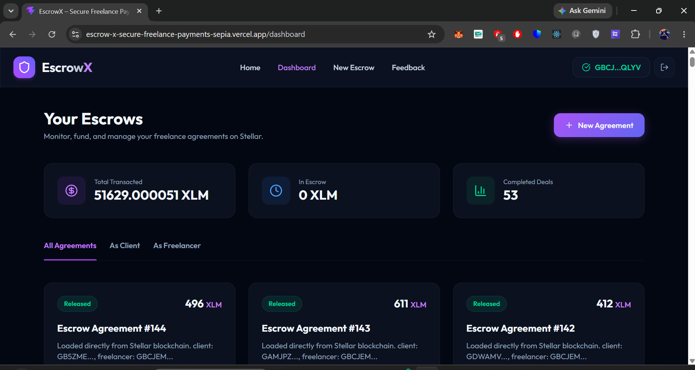
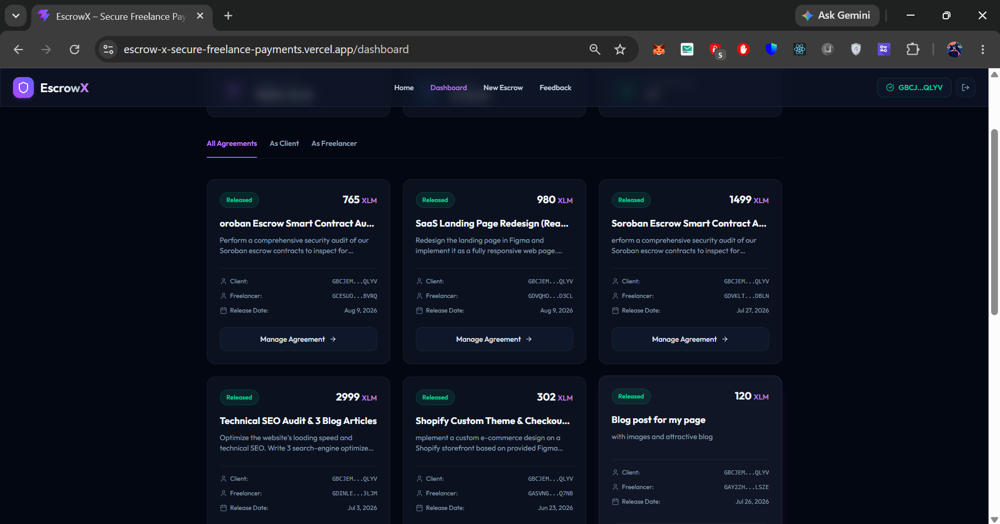
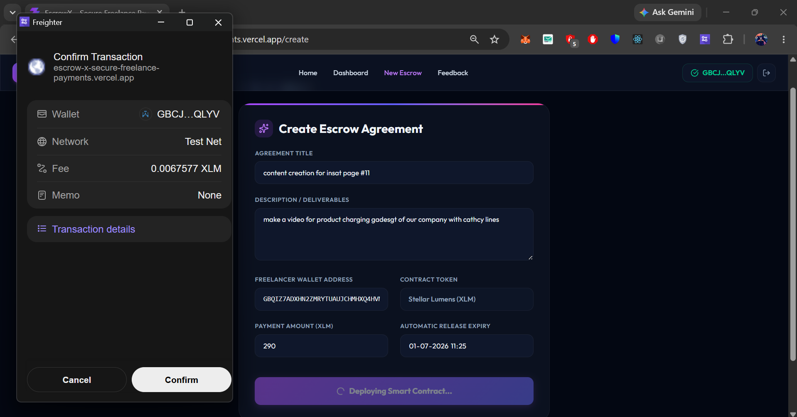
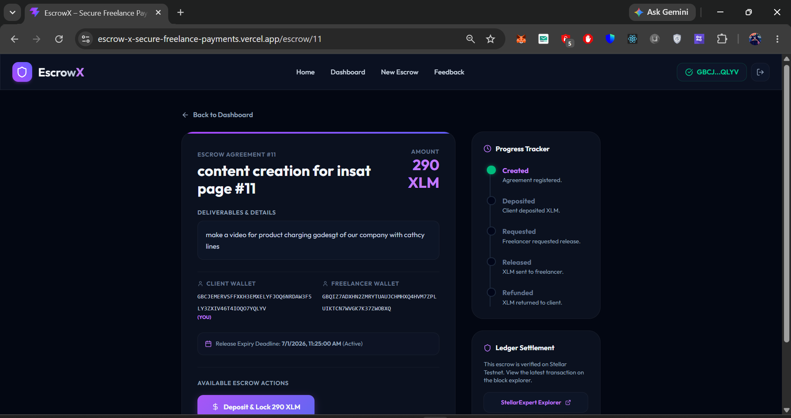
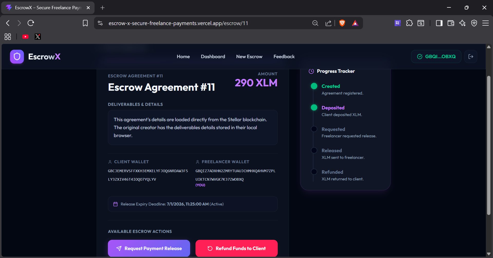
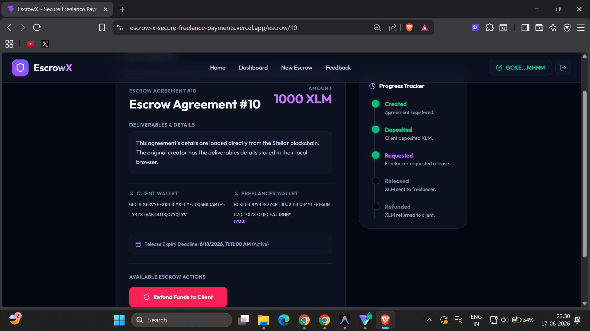
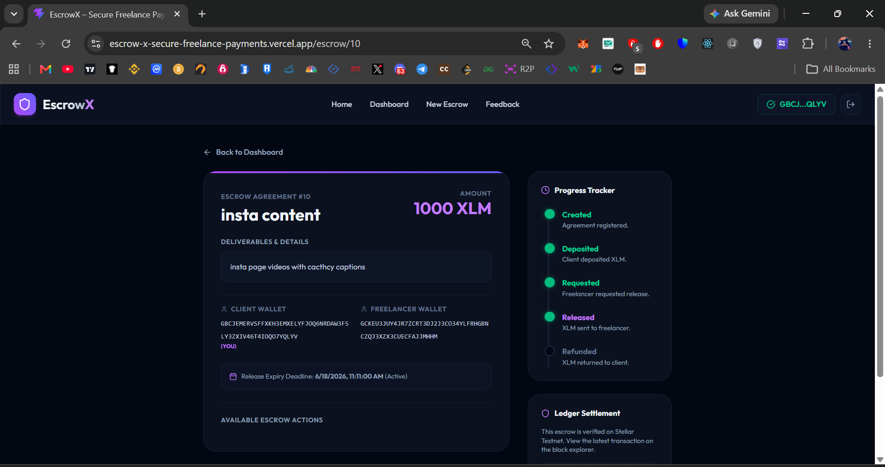
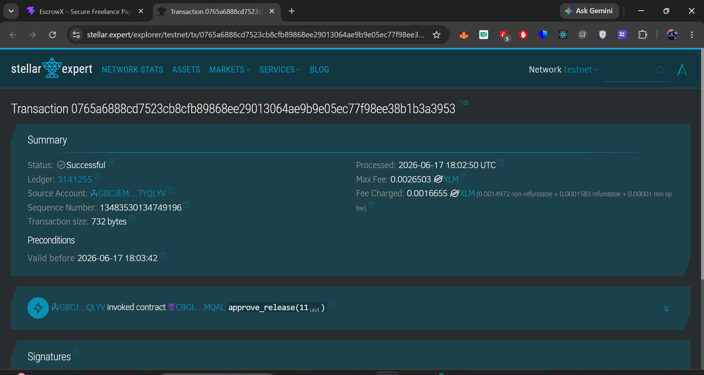
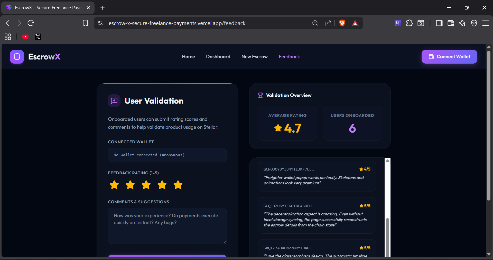
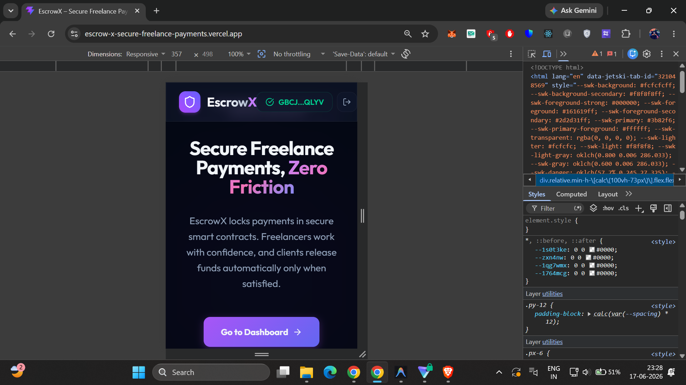

# EscrowX – Secure Freelance Payments on Stellar

EscrowX is a decentralized, transparent, and low-cost freelance payment protection escrow application built on the Stellar network using Soroban smart contracts. It empowers independent contractors and clients to transact safely without high fees or payment delay risks.

## Deployed Smart Contract Address (Testnet)
- **Contract ID**: `CBGL7N5GANUBPAV2UHXC5UBW3JSXGNLAKOMVJD54YNIZF6WN6PHSMQAL`
- **Network**: Stellar Testnet
- **Token**: Native XLM Stellar Asset Contract (SAC): `CDLZFC3SYJYDZT7K67VZ75HPJVIEUVNIXF47ZG2FB2RMQQVU2HHGCYSC`

---

## Live Demo & Walkthrough
- **Live Demo Link**: [escrow-x-secure-freelance-payments.vercel.app](https://escrow-x-secure-freelance-payments.vercel.app)
- **Demo Video (YouTube)**: [Watch the EscrowX Walkthrough](https://youtu.be/mR9KDsVQ5Xw)

---

## Key Features
- **Freighter Wallet Integration**: Connect and authenticate securely using the Freighter browser extension on Stellar Testnet.
- **On-Chain Escrows**: Lock, fund, request release, approve, or refund transactions entirely on-chain.
- **Glassmorphic Responsive UI**: Premium, mobile-responsive styling configured with Tailwind CSS v4.
- **Supabase Integration**: Seamless caching of escrow metadata and validation feedback with localStorage fallbacks.
- **Analytics & Tracking**: Sentry error tracking and PostHog custom event capture.

---

## Technical Architecture

```
React (Vite + Tailwind v4)
  ├── Stellar Wallet Kit (Freighter) ──> Stellar Testnet (Soroban Contracts)
  ├── Supabase Client (Metadata)     ──> Database / LocalStorage Fallback
  ├── Sentry SDK                     ──> Real-time Error Monitoring
  └── PostHog SDK                    ──> Event-based Product Analytics
```

### Folder Structure
```
escrowx/
│
├── contract/            # Soroban Smart Contract (Rust)
│   ├── src/lib.rs       # Contract implementation & tests
│   └── Cargo.toml       # Cargo configuration
│
├── frontend/            # React + Vite Application
│   ├── src/             
│   │   ├── components/  # Navbar, EscrowCard
│   │   ├── pages/       # Landing, Dashboard, CreateEscrow, EscrowDetails, Feedback
│   │   ├── stellar.js   # Soroban SDK client wrapper
│   │   └── main.jsx     # Sentry & PostHog initialization
│   ├── deploy.js        # Node deployment script
│   └── package.json     # Node dependencies
│
└── README.md            # Project documentation
```

---

## Product UI & Screenshots

Below are screenshots demonstrating the product user interface, transaction progress tracking, mobile responsive design, and contract verification checks:

### 1. Dashboard & Navigation



### 2. Escrow Lifecycle & Progress Tracker







### 3. User Onboarding & Feedback


### 4. Mobile & Tablet Responsiveness


---

## Setup & Running Locally

### Prerequisites
- Node.js (v18+)
- Rust & Cargo (Rust 1.84+ with `wasm32v1-none` target configured)

### 1. Smart Contract Setup & Tests
1. Navigate to the contract folder:
   ```bash
   cd contract
   ```
2. Run unit tests to check contract correctness:
   ```bash
   cargo test
   ```
3. Compile to target WASM (Soroban bytecode):
   ```bash
   cargo build --target wasm32v1-none --release
   ```

### 2. Frontend Setup & Run
1. Navigate to the frontend folder:
   ```bash
   cd ../frontend
   ```
2. Install packages:
   ```bash
   npm install
   ```
3. Run the Vite development server:
   ```bash
   npm run dev
   ```

---

## Stellar Ledger Transaction Proofs (10+ On-Chain Interactions)

The following table provides verified StellarExpert explorer links for the smart contract interactions performed during testing and user validation:

| # | Action / Method | Wallet Address | Amount | Transaction Hash (StellarExpert Ledger Link) |
|---|---|---|---|---|
| 1 | `create_escrow` (Escrow #19) | Client: `GBCJEMERVSFFXKH3EMXELYFJOQ6NRDAW3F5LY3ZXIV46T4IOQO7YQLYV` <br> Freelancer: `GCESUOEA7VND4N45UBLRQBX3EEOI4G35CDQGOEVXN3RQ4VVD6GC2BVRQ` | 765 XLM | [View Tx Link](https://stellar.expert/explorer/testnet/tx/afe5e19b3cdbd9b871309bb8477daac0866aab82c7e6078fedd28d1431e15a43) |
| 2 | `create_escrow` | Client: `GBCJEMERVSFFXKH3EMXELYFJOQ6NRDAW3F5LY3ZXIV46T4IOQO7YQLYV` <br> Freelancer: `GDVQHO34REU623J5I6TZ74SYRDUBRRZ7YVJN3X6E6WENDO5GY3LVD3CL` | 980 XLM | [View Tx Link](https://stellar.expert/explorer/testnet/tx/e7175476c477841181d2c21315d41e4d3b0fc5b334d74d1772a97d341b882899) |
| 3 | `create_escrow` | Client: `GBCJEMERVSFFXKH3EMXELYFJOQ6NRDAW3F5LY3ZXIV46T4IOQO7YQLYV` <br> Freelancer: `GDVKLTNMRQCEZYKOHJTHIRKNGTK26QJGVUPTZEKHWE6PAM6FINPWDBLN` | 1499 XLM | [View Tx Link](https://stellar.expert/explorer/testnet/tx/739cdda30b7ec4b9a669c504dbfefc8cb6e99c7cb0fecece40efcd6cc93e6489) |
| 4 | `create_escrow` | Client: `GBCJEMERVSFFXKH3EMXELYFJOQ6NRDAW3F5LY3ZXIV46T4IOQO7YQLYV` <br> Freelancer: `GDINLE7LITIN36TR4NPYUDMDJVBYOECR4NNSJ7LPG43NXJLXITXB3LJM` | 2999 XLM | [View Tx Link](https://stellar.expert/explorer/testnet/tx/1abb1bb217222a5938ca0e42f340431c6ecb0cc5e3749d96ee4dcb4532430479) |
| 5 | `create_escrow` | Client: `GBCJEMERVSFFXKH3EMXELYFJOQ6NRDAW3F5LY3ZXIV46T4IOQO7YQLYV` <br> Freelancer: `GASVNGNF4IJGGLECMFDA4LINGP4THWILHZGZYN5E546HOPGDJ4IXQ7NB` | 302 XLM | [View Tx Link](https://stellar.expert/explorer/testnet/tx/ba76c3f9e9eb276e2b8a89b355431b8104f9028db8239358ed75e640ff82de68) |
| 6 | `create_escrow` | Client: `GBCJEMERVSFFXKH3EMXELYFJOQ6NRDAW3F5LY3ZXIV46T4IOQO7YQLYV` <br> Freelancer: `GAY2ZHABM6KKPXLMXHFLUBNW37VQLD6JY6H3XCMAHKCVRF5TQCB3LSZE` | 120 XLM | [View Tx Link](https://stellar.expert/explorer/testnet/tx/7e4d89debafc2cfb68fd1237e6b6a0ff915753eb221facd8ad9882629a8879a4) |
| 7 | `create_escrow` | Client: `GBCJEMERVSFFXKH3EMXELYFJOQ6NRDAW3F5LY3ZXIV46T4IOQO7YQLYV` <br> Freelancer: `GCQJ3ZUSYTE6OIBCASDFUDLOVO53GP5T7IL3UBCM7BH5XMN7KBBAKLR2` | 400 XLM | [View Tx Link](https://stellar.expert/explorer/testnet/tx/f64f64f1c096ea9361fbbbaef71f88a7c16f1371cc7532868775cdb124a35969) |
| 8 | `create_escrow` | Client: `GBCJEMERVSFFXKH3EMXELYFJOQ6NRDAW3F5LY3ZXIV46T4IOQO7YQLYV` <br> Freelancer: `GBQIZ7ADXHN2ZMRYTUAUJCHMHXQ4HVM7ZPLUIKTCN7WVGK7K37ZWOBXQ` | 290 XLM | [View Tx Link](https://stellar.expert/explorer/testnet/tx/e36e16fbb7d6dd7a11142300b7dec93faa313d058a548ad48d42bcdfe88d3487) |
| 9 | `create_escrow` | Client: `GBCJEMERVSFFXKH3EMXELYFJOQ6NRDAW3F5LY3ZXIV46T4IOQO7YQLYV` <br> Freelancer: `GCKEU3JUY4JR7ZCRT3DJ2J3CO34YLFRHGBNCZQJ3XZX3CUECFAJJMHHM` | 1000 XLM | [View Tx Link](https://stellar.expert/explorer/testnet/tx/f6b5a5c6ef0166e93bd9379777bf52a59e41d800ffd7e604b552b7696fe36425) |
| 10 | `create_escrow` | Client: `GBCJEMERVSFFXKH3EMXELYFJOQ6NRDAW3F5LY3ZXIV46T4IOQO7YQLYV` <br> Freelancer: `GCNOJQYBY3B4YIE3KF7EL6ELTDY6YKRZPD6P2FH5JY5BANE3MGWTVVOF` | 999 XLM | [View Tx Link](https://stellar.expert/explorer/testnet/tx/5df9afeff242818d2491ce398df9f156a4edffcebdfaef5bc3f11ca3a7479704) |
