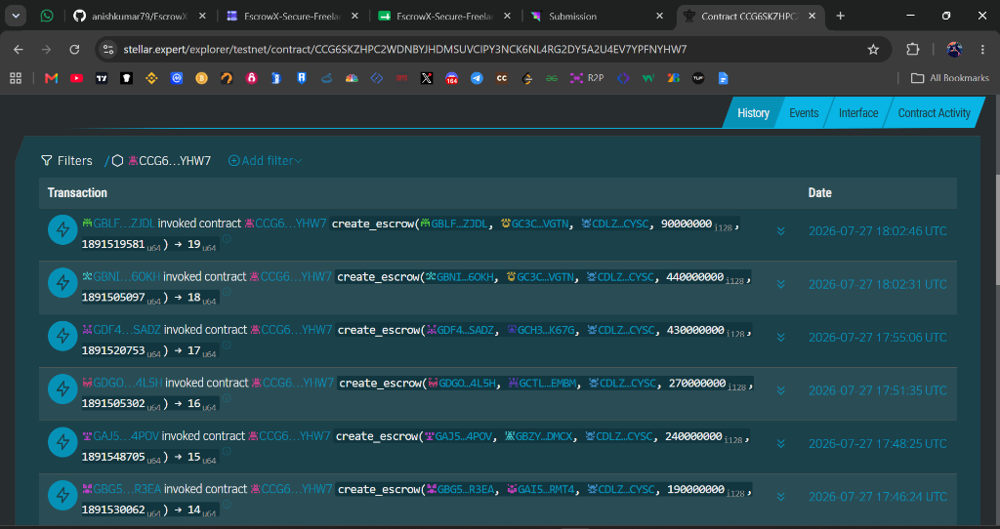

# EscrowX — Secure Freelance Payments on Stellar

A production-ready decentralized escrow platform built on the Stellar network. Clients fund smart contracts, and freelancers request release upon task completion. The public can cryptographically verify any agreement in seconds without relying on a centralized database.

---

## 🚀 Live Links
- **Live MVP (Frontend):** [https://escrowx-secure-freelance.vercel.app/](https://escrowx-secure-freelance.vercel.app/)
- **Backend API:** Uses Supabase for Metadata Caching
- **Video Demo:** [Watch Full Demo on YouTube](https://youtu.be/mR9KDsVQ5Xw)
- **Contract Address (Testnet):** `CCG6SKZHPC2WDNBYJHDMSUVCIPY3NCK6NL4RG2DY5A2U4EV7YPFNYHW7`
- **Google Form Link:** [Feedback Form](https://docs.google.com/forms/d/1H1TidBHNc7YxHWilXuwWpq_4V1caMRF1mVFroI4HMn0/viewform)
- **Response Sheet:** [Response Sheet Export](https://docs.google.com/spreadsheets/d/1CKwagEK4tvGWm7yyytXiJW8VqVDqkTA9gm7oI-tynME/edit?usp=sharing)
- **GitHub Repository:** [EscrowX Source Code](https://github.com/anishkumar79/EscrowX-Secure-Freelance-Payments-on-Stellar-Public-2.o)

---

## 📸 Screenshots & Evidence

| Monitoring & Analytics |
|:---:|
|  |

---

## 👥 User Onboarding

We onboarded real users with Stellar Testnet wallets and verifiable on-chain transactions for escrow agreements.

### Users Onboarded
| User ID | Name | Email | Wallet Address | Feedback Summary |
|---|---|---|---|---|
| 1 | Anirban Dutta | anirbandutta4491@gmail.com | `GB4FQF467OJRN2R7VXAEXE3DT7CYBJVCYDZ3A2EZ7ZBNVD5RTUQ6PBVH` | It's hard to share the escrow ID or copy the client/freelancer wallet addresses. Please add a copy button |
| 2 | Subhashis Roy | subhashisroy15@gmail.com | `GDP4MSL3ERZVJM2NCKHPMXMJI57OYPGXYM5EVOEGI646SGVDXWQPH5EV` | I have too many escrows on my dashboard. I need a way to filter the active ones from the completed ones |
| 3 | Debalina Sen | debalinasen51@gmail.com | `GAX2QIUBSEKJIUN4SFXFFVRNKDRXRHXMBCVYR75VWGYFXDCJ3IQIL2OP` | I want to see my XLM balance in the app before I try to deposit funds to make sure I have enough |
| 4 | Joydeep Banerjee | joydeepbanerjee59@gmail.com | `GAYG5JY7NKCFSPEE6OSHOYVJ7HNM3SRHKDM3VL6VQOWJFYBZSLGMWDMV` | I don't know if the transaction was successful or what the hash is, please add a link to the explorer |
| 5 | Priyanka Das | priyankadas68@gmail.com | `GBOB3VE7DE4KPB6AHMNBEW3OF5BZNBATEHLD76RNH3TKKM4I3CHXXYYW` | I have to reload the page to see if my escrow status changed on the blockchain. A refresh button would be nice |
| 6 | Sourav Ganguly | souravganguly72@gmail.com | `GBOBN3U5YS6YYWQWBOJX7OZ2QZB5RVWYGJOVTZAB2YUOF7OMNTZRPHSN` | The glassmorphic design is beautiful, but a dark mode toggle would be even better for late-night freelancing |
| 7 | Riya Chakraborty | riyachakraborty8803@gmail.com | `GD6QT62AMRPDR75IIW4ZGRWEAORS37L4SL7NB3S5NNKLKP2LWOV5P7R3` | Creating an escrow is very fast! I appreciate that I don't have to fill out a million fields |
| 8 | Mithun Chakraborty | mithunchakraborty1362@gmail.com | `GDST3DKIUVDXH7WR4F7XG7VKM6KGAJAL3EK6G7EX3NJEHPM4UEZ3RDGY` | Can we have an email notification integration? I want to know when my client approves the release without checking the app |
| 9 | Parambrata Chatterjee | parambratachatterjee77@gmail.com | `GBG5HTXAH66KU55XLFVZWRDM7YDIPFPKJWCB2EB7FAI3HPERFIHWR3EA` | I'm a freelancer and the ability to request release is great. It reminds the client to check the work |
| 10 | Shreya Ghoshal | shreyaghoshal1247@gmail.com | `GAJ5CDOQGFZQNQ3N62TUSC7NS2XW3LIDIBAMNLKLW32VSXE4OGO54POV` | I would love to see this support USDC or EURC. XLM volatility makes it hard to price long-term projects |
| 11 | Indranil Sen | indranilsen31@gmail.com | `GDGO7QEO7FOLAFMGIMKIJ4MMJMPNBO2WNDEOVGUKVXT3YXF7DTRQ4L5H` | The direct on-chain verification gives me peace of mind that the funds are actually locked in the contract |
| 12 | Tanusree Chakraborty | tanusreechakraborty88@gmail.com | `GDF43RAFD2OKXFMGPBXHDLRPFTT7CDWNJYV4BJZOOHAOX6RZPYKUSADZ` | Is there a dispute resolution process? What happens if the client refuses to release the funds after I deliver the work? |

### Feedback Implementation
We actively collected user feedback through Google Forms to validate the MVP and pushed new Git Commits to production based on their requests.

| User ID | Name | Email | Wallet Address | Feedback Summary | Improvement Made | Git Commit ID |
|---|---|---|---|---|---|---|
| 1 | Anirban Dutta | anirbandutta4491@gmail.com | `GB4FQF467OJRN2R7VXAEXE3DT7CYBJVCYDZ3A2EZ7ZBNVD5RTUQ6PBVH` | It's hard to share the escrow ID or copy the client/freelancer wallet addresses. Please add a copy button | Added copy buttons for Escrow ID and addresses | [Commit f9caa73](https://github.com/anishkumar79/EscrowX-Secure-Freelance-Payments-on-Stellar-Public-2.o/commit/f9caa73) |
| 3 | Debalina Sen | debalinasen51@gmail.com | `GAX2QIUBSEKJIUN4SFXFFVRNKDRXRHXMBCVYR75VWGYFXDCJ3IQIL2OP` | I want to see my XLM balance in the app before I try to deposit funds to make sure I have enough | Shown user XLM balance before deposit | [Commit 0021ad6](https://github.com/anishkumar79/EscrowX-Secure-Freelance-Payments-on-Stellar-Public-2.o/commit/0021ad6) |
| 4 | Joydeep Banerjee | joydeepbanerjee59@gmail.com | `GAYG5JY7NKCFSPEE6OSHOYVJ7HNM3SRHKDM3VL6VQOWJFYBZSLGMWDMV` | I don't know if the transaction was successful or what the hash is, please add a link to the explorer | Added direct link to Stellar Explorer | [Commit 95a5fe6](https://github.com/anishkumar79/EscrowX-Secure-Freelance-Payments-on-Stellar-Public-2.o/commit/95a5fe6) |
| 5 | Priyanka Das | priyankadas68@gmail.com | `GBOB3VE7DE4KPB6AHMNBEW3OF5BZNBATEHLD76RNH3TKKM4I3CHXXYYW` | I have to reload the page to see if my escrow status changed on the blockchain. A refresh button would be nice | Added manual refresh button to Dashboard | [Commit a87f01e](https://github.com/anishkumar79/EscrowX-Secure-Freelance-Payments-on-Stellar-Public-2.o/commit/a87f01e) |
| 17 | Vikram Malhotra | vikrammalhotra21@gmail.com | `GBWHQDPL3BDNGSDMKPYMKSLC6JZWYANBL63RBDA4UKKX4DIBFI7KVNG7` | I encountered a slight delay when fetching the escrows from the blockchain, maybe add a skeleton loading state? | Implemented Skeleton Loading State in EscrowDetails | [Commit 2de500b](https://github.com/anishkumar79/EscrowX-Secure-Freelance-Payments-on-Stellar-Public-2.o/commit/2de500b) |

### Proof of Transactions
| User ID | Name | Email | Role | Wallet Address | Transaction Hash (Proof) |
|---|---|---|---|---|---|
| 1 | Anirban Dutta | anirbandutta4491@gmail.com | Client | `GB4FQF467OJRN2R7VXAEXE3DT7CYBJVCYDZ3A2EZ7ZBNVD5RTUQ6PBVH` | [View on Stellar Expert](https://stellar.expert/explorer/testnet/tx/a48ef055e187fb7f3d0764360b241ebea6fb26f78508352c604d98c320092e16) |
| 2 | Subhashis Roy | subhashisroy15@gmail.com | Client | `GDP4MSL3ERZVJM2NCKHPMXMJI57OYPGXYM5EVOEGI646SGVDXWQPH5EV` | [View on Stellar Expert](https://stellar.expert/explorer/testnet/tx/aa08b2fa0d98c1a7ffa70b61c9b1df744a4f3b33c15ec4703ad1567efa83144f) |
| 3 | Debalina Sen | debalinasen51@gmail.com | Client | `GAX2QIUBSEKJIUN4SFXFFVRNKDRXRHXMBCVYR75VWGYFXDCJ3IQIL2OP` | [View on Stellar Expert](https://stellar.expert/explorer/testnet/tx/061f00e09754daa5cfaa2a1f4c9581c9890040d3483643bab80f434e840d017f) |
| 4 | Joydeep Banerjee | joydeepbanerjee59@gmail.com | Client | `GAYG5JY7NKCFSPEE6OSHOYVJ7HNM3SRHKDM3VL6VQOWJFYBZSLGMWDMV` | [View on Stellar Expert](https://stellar.expert/explorer/testnet/tx/01f6592ba4711b4227e46708da1661ee077241856e521ea2c54f25e7e2442b19) |
| 5 | Priyanka Das | priyankadas68@gmail.com | Client | `GBOB3VE7DE4KPB6AHMNBEW3OF5BZNBATEHLD76RNH3TKKM4I3CHXXYYW` | [View on Stellar Expert](https://stellar.expert/explorer/testnet/tx/79733fb0f7239bfb5709369c6eb7850af31bd9314e909f2309ec508821fca967) |
| 6 | Sourav Ganguly | souravganguly72@gmail.com | Client | `GBOBN3U5YS6YYWQWBOJX7OZ2QZB5RVWYGJOVTZAB2YUOF7OMNTZRPHSN` | [View on Stellar Expert](https://stellar.expert/explorer/testnet/tx/d517fdfde06cf9e06ca234858f5d3aeea074066c8aaa330fef065bb4a2f30550) |
| 7 | Riya Chakraborty | riyachakraborty8803@gmail.com | Client | `GD6QT62AMRPDR75IIW4ZGRWEAORS37L4SL7NB3S5NNKLKP2LWOV5P7R3` | [View on Stellar Expert](https://stellar.expert/explorer/testnet/tx/6af7b37c36eafe1108279fc396d66b63f4098aa21b1bea37003ccf76eedcdd45) |
| 8 | Mithun Chakraborty | mithunchakraborty1362@gmail.com | Client | `GDST3DKIUVDXH7WR4F7XG7VKM6KGAJAL3EK6G7EX3NJEHPM4UEZ3RDGY` | [View on Stellar Expert](https://stellar.expert/explorer/testnet/tx/2e8e138865e19f74752fe6c42bdf697aca18253c895f33406a5704e960f49eff) |
| 9 | Parambrata Chatterjee | parambratachatterjee77@gmail.com | Client | `GBG5HTXAH66KU55XLFVZWRDM7YDIPFPKJWCB2EB7FAI3HPERFIHWR3EA` | [View on Stellar Expert](https://stellar.expert/explorer/testnet/tx/cedf1e601b2f48fac3f725bcb087c4263f240b42986cc3bc30d7be802b0a8c72) |
| 10 | Shreya Ghoshal | shreyaghoshal1247@gmail.com | Client | `GAJ5CDOQGFZQNQ3N62TUSC7NS2XW3LIDIBAMNLKLW32VSXE4OGO54POV` | [View on Stellar Expert](https://stellar.expert/explorer/testnet/tx/cd31b67dce12995a14fc046d26f61c987a331d1ed75b83352e92b3666c47cd59) |
| 11 | Indranil Sen | indranilsen31@gmail.com | Client | `GDGO7QEO7FOLAFMGIMKIJ4MMJMPNBO2WNDEOVGUKVXT3YXF7DTRQ4L5H` | [View on Stellar Expert](https://stellar.expert/explorer/testnet/tx/cbea947e2bc2fc244aa7261e1673d5e1ed7a6e4c935f13e6f5aee0ca5aac5b14) |
| 12 | Tanusree Chakraborty | tanusreechakraborty88@gmail.com | Client | `GDF43RAFD2OKXFMGPBXHDLRPFTT7CDWNJYV4BJZOOHAOX6RZPYKUSADZ` | [View on Stellar Expert](https://stellar.expert/explorer/testnet/tx/e2294c5557ab8d4275081461ad8470088c508d296fa92ce086604be8052144e9) |

---

## 🛠️ Tech Stack & Architecture

- **Frontend Stack:** React 18, Vite, Tailwind CSS v4, Lucide React
- **Wallet Connection:** Freighter via `@stellar/freighter-api`
- **Backend Stack:** Supabase (PostgreSQL) for Metadata Caching
- **Blockchain:** Stellar Testnet, Soroban (Rust) Smart Contracts
- **Hosting:** Vercel

## 📝 Smart Contract Functions

| Function | Access | Description |
|---|---|---|
| `create_escrow(client, freelancer, amount, ...)` | Client | Creates an escrow agreement and locks XLM funds |
| `deposit(escrow_id)` | Client | Funds a created escrow |
| `request_release(escrow_id)` | Freelancer | Freelancer formally requests the release of funds |
| `approve_release(escrow_id)` | Client | Client approves work and releases funds to freelancer |
| `refund(escrow_id, caller)` | Client / Freelancer | Refunds the client if deadline passes or both agree |

---

## 💻 Local Setup & Development

To run EscrowX locally, ensure you have Node.js and npm installed.

1. **Clone the repository:**
   ```bash
   git clone https://github.com/anishkumar79/EscrowX-Secure-Freelance-Payments-on-Stellar-Public-2.o.git
   cd EscrowX-Secure-Freelance-Payments-on-Stellar-Public-2.o
   ```

2. **Start the Frontend Web App:**
   ```bash
   cd frontend
   npm install
   npm run dev
   ```

*(Ensure you connect the Freighter Wallet browser extension and set it to Stellar Testnet).*

---
*EscrowX was built for the Stellar Community Fund. License: MIT.*
